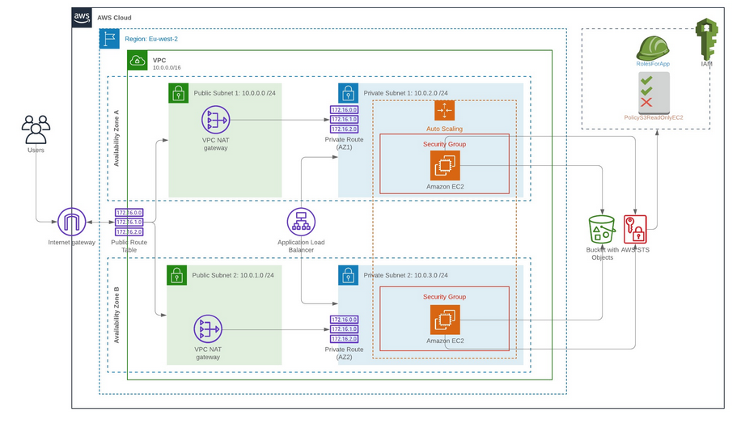

#High-Availability-Web-App-using-CloudFormation

This is a repository for the second project in the Cloud Computing at UTSA.

The objective of this project is to create the required AWS infrastructure (Network and EC2 Servers) using Infrastructure as Code AWS Cloudformation scripts, the source code of the Web Application would be downloaded to the EC2 servers from AWS S3 Storage.
> In this project (Udagram App), I deployed web servers for a highly available web app using CloudFormation.
> I wrote the script that creates and deploys the infrastructure and application for an Udagram app from the ground up.
> The script begin deploying the networking components followed by servers, security roles and software.
> * infrastructure.yml :  Project's CloudFormation script.

